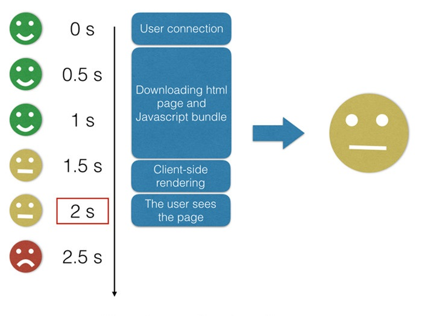
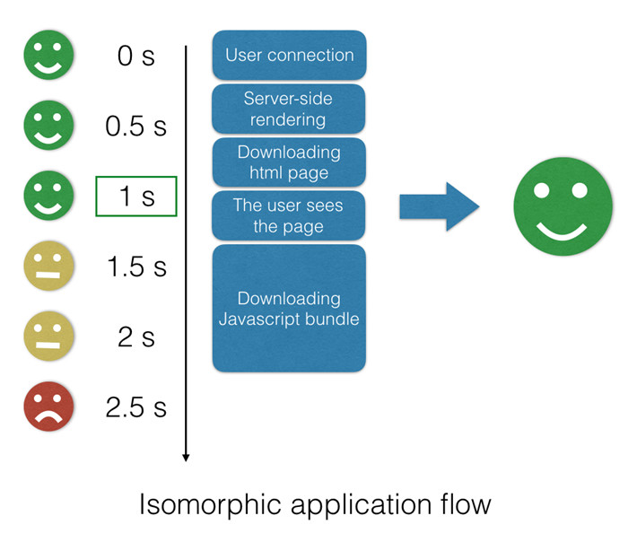
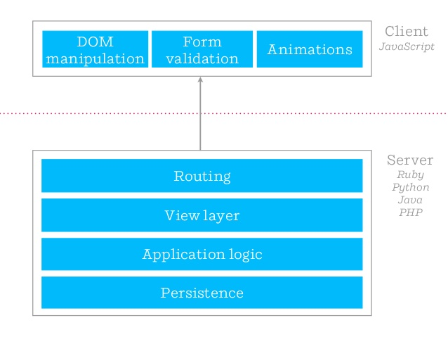
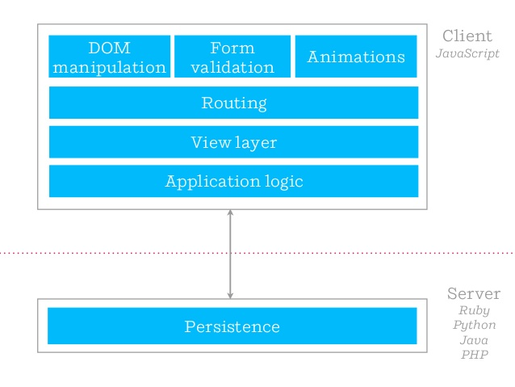
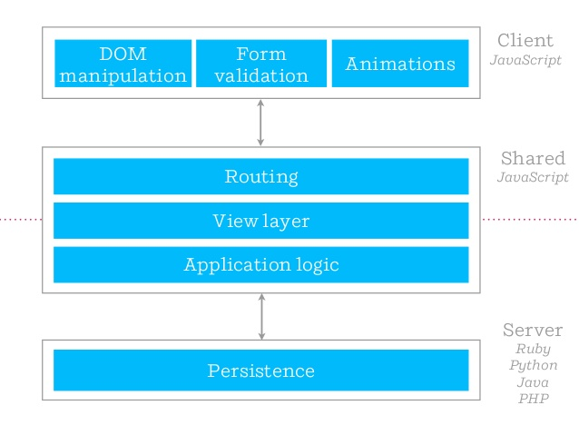
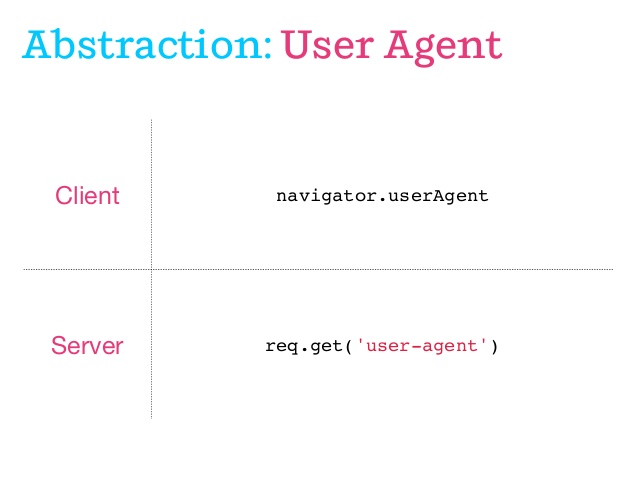
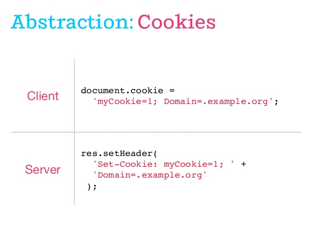
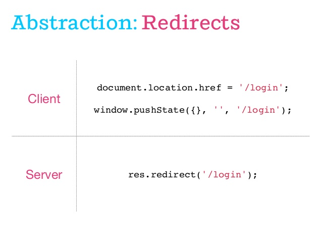

# IMVC（同构 MVC）的前端实践
作者：古映杰@携程度假研发部

## 导语
随着 Backbone 等老牌框架的逐渐衰退，前端 MVC 发展缓慢，有逐渐被 MVVM/Flux 所取代的趋势。

然而，纵观近几年的发展，可以发现一点，React/Vue 和 Redux/Vuex 是分别在 MVC 中的 View 层和 Model 层做了进一步发展。如果 MVC 中的 Controller 层也推进一步，将得到一种升级版的 MVC，我们称之为 IMVC（同构 MVC）。

IMVC 可以实现一份代码在服务端和浏览器端皆可运行，具备单页应用和多页应用的所有优势，并且可以这两种模式里通过配置项进行自由切换。配合 Node.js、Webpack、Babel 等基础设施，我们可以得到相比之前更加完善的一种前端架构。

## 目录
- 1、同构的概念和意义
  * 1.1、isomorphic 是什么？
  * 1.2、isomorphic javascript
- 2、同构的种类和层次
  * 2.1、同构的种类
  * 2.2、同构的层次
- 3、同构的价值和作用
  * 3.1、同构的价值
  * 3.2、同构如何加快访问体验
  * 3.3、同构是未来的趋势
- 4、同构的实现策略
- 5、IMVC 架构
  * 5.1、IMVC 的目标
  * 5.2、IMVC 的技术选型
  * 5.3、为什么不直接用 React 全家桶？
  * 5.4、用 create-app 代替 react-router
    - 5.4.1、create-app 的同构理念
    - 5.4.2、create-app 的配置理念
    - 5.4.3、create-app 的服务端渲染
    - 5.4.4、create-app 的扁平化路由理念
    - 5.4.5、create-app 的目录结构
  * 5.5、controller 的基本模式
  * 5.6、redux 的简化版 relite
  * 5.7、Isomorphic-MVC 的工程化设施
    - 5.7.1、如何实现代码实时热更新？
    - 5.7.2、如何处理 CSS 按需加载？
    - 5.7.3、如何实现代码切割、按需加载？
    - 5.7.4、如何处理静态资源的版本管理？
    - 5.7.5、如何管理命令行任务？
- 6、实践案例
- 7、结语
  

## 1、同构的概念和意义

### 1.1、isomorphic 是什么？

isomorphic，读作[ˌaɪsə'mɔ:fɪk]，意思是：同形的，同构的。

维基百科对它的描述是：同构是在数学对象之间定义的一类映射,它能揭示出在这些对象的属性或者操作之间存在的关系。若两个数学结构之间存在同构映射，那么这两个结构叫做是同构的。一般来说，如果忽略掉同构的对象的属性或操作的具体定义，单从结构上讲，同构的对象是完全等价的。

同构，也被化用在物理、化学以及计算机等其他领域。

### 1.2、isomorphic javascript

isomorphic javascript（同构 js），是指一份 js 代码，既然可以跑在浏览器端，也可以跑在服务端。


同构 js 的发展历史，比 progressive web app 还要早很多。2009 年， node.js 问世，给予我们前后端统一语言的想象；更进一步的，前后端公用一套代码，也不是不可能。

有一个网站 [isomorphic.net](http://isomorphic.net)，专门收集跟同构 js 相关的文章和项目。从里面的文章列表来看，早在 2011 年的时候，业界已经开始探讨同构 js，并认为这将是未来的趋势。

可惜的是，同构 js 其实并没有得到真正意义上的发展。因为，在 2011 年，node.js 和 ECMAScript 都不够成熟，我们并没有很好的基础设施，去满足同构的目标。

现在是 2017 年，情况已经有所不同。ECMAScript 2015 标准定案，提供了一个标准的模块规范，前后端通用。尽管目前 node.js 和浏览器都没有实现 ES2015 模块标准，但是我们有 Babel 和 Webpack 等工具，可以提前享用新的语言特性带来的便利。

## 2、同构的种类和层次

### 2.1、同构的种类

同构 js 有两个种类：「内容同构」和「形式同构」。

其中，「内容同构」指服务端和浏览器端执行的代码完全等价。比如：

```javascript
function add(a, b) {
    return a + b
}
```

不管在服务端还是浏览器端，`add` 函数都是一样的。

而「形式同构」则不同，从原教旨主义的角度上看，它不是同构。因为，在浏览器端有一部分代码永远不会执行，而在服务端另一部分代码永远不会执行。比如：

```javascript
function doSomething() {
  if (isServer) {
      // do something in server-side
  } else if (isClient) {
      // do something in client-side
  }
}
```

在 npm 里，有很多 package 标榜自己是同构的，用的方式就是「形式同构」。如果不作特殊处理，「形式同构」可能会增加浏览器端加载的 js 代码的体积。比如 React，它的 140+kb 的体积，是把只在服务端运行的代码也包含了进去。

### 2.2、同构的层次

同构不是一个布尔值，true 或者 false；同构是一个光谱形态，可以在很小范围里上实现同构，也可以在很大范围里实现同构。

- function 层次：零碎的代码片断或者函数，支持同构。比如浏览器端和服务端都实现了 setTimeout 函数，比如 lodash/underscore 的工具函数都是同构的。

- feature 层次：在这个层次里的同构代码，通常会承担一定的业务职能。比如 React 和 Vue 都借助 virtual-dom 实现了同构，它们是服务于 View 层的渲染；比如 Redux 和 Vuex 也是同构的，它们负责 Model 层的数据处理。

- framework 层次：在框架层面实现同构，它可能包含了所有层次的同构，需要精心处理支持同构和不支持同构的两个部分，如何妥善地整合在一起。

我们今天所讨论的 isomorphic-mvc（简称 IMVC），是在 framework 层次上实现同构。

## 3、同构的价值和作用

### 3.1、同构的价值

同构 js，不仅仅有抽象上的美感，它还有很多实用价值。

- SEO 友好：View 层在浏览器端和服务端都可以运行，意味着可以在服务端吐出 html，支持搜索引擎的抓取。

- 加快访问体验：服务端渲染可以加快浏览器端的首次访问的渲染速度，而浏览器端渲染，可以加快用户交互时的反馈速度。

- 代码的可维护性：同构可以减少语言切换的成本，减小代码的重复率，增加代码的可维护性。

不使用同构方案，也可以用别的办法实现前两个的目标，但是别的办法却难以同时满足三个目标。

### 3.2、同构如何加快访问体验

纯浏览器端渲染的问题在于，页面需要等待 js 加载完毕之后，才可见。

client-side renderging


服务端渲染可以加速首次访问的体验，在 js 加载之前，页面就渲染了首屏。但是，用户只对首次加载有耐心，如果操作过程中，频繁刷新页面，也会带给用户缓慢的感觉。

SERVER-SIDE RENDERING


同构渲染则可以得到两种好处，在首次加载时用服务端渲染，在交互过程中则采取浏览器端渲染。

### 3.3、同构是未来的趋势

从历史发展的角度看，同构确实是未来的一大趋势。

在 Web 开发的早期，采用的开发模式是：fat-server, thin-client



前端只是薄薄的一层，负责一些表单验证，DOM 操作和 JS 动画。在这个阶段，没有「前端工程师」这个工种，服务端开发顺便就把前端代码给写了。

在 Ajax 被发掘出来之后，Web 进入 2.0 时代，我们普遍推崇的模式是：thin-server, fat-client



越来越多的业务逻辑，从服务端迁移到前端。开始有「前后端分离」的做法，前端希望服务端只提供 restful 接口和数据持久化。

但是在这个阶段，做得不够彻底。前端并没有完全掌控渲染层，起码 html 骨架需要服务端渲染，以及前端实现不了服务端渲染。

为了解决上述问题，我们正在进入下一个阶段，这个阶段所采取的模式是：shared, fat-server, fat-client



通过 node.js 运行时，前端完全掌控渲染层，并且实现渲染层的同构。既不牺牲服务端渲染的价值，也不放弃浏览器端渲染的便利。

这就是未来的趋势。

## 4、同构的实现策略

要实现同构，首先要正视一点，全盘同构是没有意义的。为什么？

服务端和浏览器端毕竟是两个不同的平台和环境，它们专注于解决不同的问题，有自身的特点，全盘同构就抹杀了它们固有的差异，也就无法发挥它们各自的优势。

因而，我们只会在 client 和 server 有交集的部分实现同构。就是在服务端渲染 html 和在浏览器端复用 html 的整个过程里，实现同构。

我们采取的主要做法有两个：1）能够同构的代码，直接复用；2）无法同构的代码，封装成形式同构。

举几个例子。

获取 User-Agent 字符串。



我们可以在服务端用 `req.get('user-agent')` 模拟出 navigator 全局对象，也可以提供一个 `getUserAgent` 的方法或函数。

获取 Cookies。



Cookies 处理在我们的场景里，存在快捷通道，因为我们只专注首次渲染的同构，其它的操作可以放在浏览器端二次渲染的时候再处理。

Cookies 的主要用途发生在 ajax 请求的时候，在浏览器端 ajax 请求可以设置为自动带上 Cookies，所以只需要在服务端默默地在每个 ajax 请求头里补上 Cookies 即可。

Redirects 重定向处理



重定向的场景比较复杂，起码有三种情况：

- 服务端 302 重定向: `res.redirect(xxx)`
- 浏览器端 location 重定向：`location.href = xxx ` 和 `location.replace(xxx)`
- 浏览器端 pushState 重定向：`history.push(xxx)` 和 `history.replace(xxx)`

我们需要封装一个 redirect 函数，根据输入的 url 和环境信息，选择正确的重定向方式。

## 5、IMVC 架构

## 5.1、IMVC 的目标

IMVC 的目标是框架层面的同构，我们要求它必须实现以下功能

- 用法简单，初学者也能快速上手
- 只维护一套 ES2015+ 的代码
- 既是单页应用，又是多页应用（SPA + SSR）
- 可以部署到任意发布路径 (Basename/RootPath)
- 一条命令启动完备的开发环境
- 一条命令完成打包/部署过程

有些功能属于运行时的，有些功能则只服务于开发环境。JavaScript 虽然是一门解释型语言，但前端行业发展到现阶段，它的开发模式已经变得非常丰富，既可以用最朴素的方式，一个记事本加上一个浏览器，也可以用一个 IDE 加上一系列开发、测试和部署流程的支持。

### 5.2、IMVC 的技术选型

- Router: create-app = history + path-to-regexp
- View: React = renderToDOM || renderToString
- Model: relite = redux-like library
- Ajax: isomorphic-fetch

理论上，IMVC 是一种架构思路，它并不限定我们使用哪些技术栈。不过，要使 IMVC 落地，总得做出选择。上面就是我们当前选择的技术栈，将来它们可能升级或者替换为其它技术。

## 为什么不直接用 React 全家桶？

大家可能注意到，我们使用了许多 React 相关的技术，但却不是所谓的 `React 全家桶`，原因如下：

- 目前的 React 全家桶其实是野生的，Facebook 并不用
- React-Router 的理念难以满足要求 
- Redux 适用于大型应用，而我们的主要场景是中小型
- 升级频繁导致学习成本过高，需封装一层更简洁的 API

目前的全家桶，只是社区里的一些热门库的组合罢了。Facebook 真正用的全家桶是 `react|flux|relay|graphql`，甚至他们并不用 React 做服务端渲染，用的是 PHP。

我们认为 `React-Router` 的理念在同构上是错误的。它忽视了一个重大事实：服务端是 Router 路由驱动的，把 Router 和作为 View 的 React 捆绑起来，View 已经实例化了，Router 怎么再加载 Controller 或者异步请求数据呢？

从函数式编程的角度看，`React` 推崇纯组件，需要隔离副作用，而 Router 则是副作用来源，将两者混合在一起，是一种污染。另外，Router 并不是 UI，却被写成 JSX 组件的形式，这也是有待商榷的。

所以，即便是当前最新版的 `React-Router-v4`，实现同构渲染时，做法也复杂而臃肿，服务端和浏览器端各有一个路由表和发 ajax 请求的逻辑。[点击这里查看代码](https://github.com/technology-ebay-de/universal-react-router4/blob/master/src/server/index.js)

至于 Redux，其作者也已在公开场合表示：「你可能不需要 Redux」。在引入 redux 时，我们得先反思一下引入的必要性。

毫无疑问，Redux 的模式是优秀的，结构清晰，易维护。然而同时它也是繁琐的，实现一个功能，你可能得跨文件夹地操作数个文件，才能完成。这些代价所带来的显著好处，要在 app 复杂到一定程度时，才能真正体会。其它模式里，app 复杂到一定程度后，就难以维护了；而 Redux 的可维护性还依然坚挺，这就是其价值所在。（值得一提的是，基于 redux 再封装一层简化的 API，我认为这很可能是错误的做法。Redux 的源码很简洁，意图也很明确，要简化固然也是可以的，但它为什么自己不去做？它是不是刻意这样设计呢？你的封装是否损害了它的设计目的呢？）

在使用 Redux 之前要考虑的是，我们 web-app 属于大型应用的范畴吗？

前端领域日新月异，框架和库的频繁升级让开发者应接不暇。我们需要根据自身的需求，进行二次封装，得到一组更简洁的 API，将部分复杂度隐藏起来，以降低学习成本。

## 用 create-app 代替 react-router

`create-app` 是我们为了同构而实现的一个 `library`，它由下面三部分组成：

- history： react-router 依赖的底层库
- path-to-regexp： expressjs 依赖的底层库
- Controller：在 View(React) 层和 Model 层之外实现 Controller 层

`create-app` 复用 `React-Router` 的依赖 `history.js`，用以在浏览器端管理 history 状态；复用 `expressjs` 的 `path-to-regexp`，用以从 `path pattern` 中解析参数。 

我们认为，`React` 和 `Redux` 分别对应 `MVC` 的 `View` 和 `Model`，它们都是同构的，我们需要的是实现 `Controller` 层的同构。 

## create-app 的同构理念


`create-app` 实现同构的方式是：

- 输入 url，router 根据 url 的格式，匹配出对应的 controller 模块
- 调用 module-loader 加载 controller 模块，拿到 Controller 类
- View 和 Model 从属于 Controller 类的属性
- `new Controller(location, context)` 得到 controller 实例
- 调用 `controller.init` 方法，该方法必须返回 view 的实例
- 调用 view-engine 将 view 的实例根据环境渲染成 html 或者 dom 或者 native-ui 等

上述过程在服务端和浏览器端都保持一致。

## create-app 的配置理念

服务端和浏览器端加载模块的方式不同，服务端是同步加载，而浏览器端则是异步加载；它们的 view-engine 也是不同的。如何处理这些不一致？

答案是配置。

```javascript
const app = createApp({
    type: 'createHistory',
    container: '#root',
    context: {
        isClient: true|false,
        isServer: false|true,
        ...injectFeatures
    },
    loader: webpackLoader|commonjsLoader,
    routes: routes,
    viewEngine: ReactDOM|ReactDOMServer,
})
app.start() || app.render(url, context)
```
服务端和浏览器端分别有自己的入口文件：client-entry.js 和 server.entry.js。我们只需提供不同的配置即可。

在服务端，加载 controller 模块的方式是 commonjsLoader；在浏览器端，加载 controller 模块的方式则为 webpackLoader。

在服务端和浏览器端，view-engine 也被配置为不同的 ReactDOM 和 ReactDOMServer。

每个 controller 实例，都有 context 参数，它也是来自配置。通过这种方式，我们可以在运行时注入不同的平台特性。这样既分割了代码，又实现了形式同构。

## create-app 的服务端渲染

我们认为，简洁的，才是正确的。`create-app` 实现服务端渲染的代码如下：

```javascript
const app = createApp(serverSettings)
router.get('*', async (req, res, next) => {
  try {
    const { content } = await app.render(req.url, serverContext)
    res.render('layout', { content })
  } catch(error) {
    next(error)
  }
})
```

没有多余的信息，也没有多余的代码，输入一个 url 和 context，返回具有真实数据 html 字符串。

### 5.4.4、create-app 的扁平化路由理念

`React-Router` 支持并鼓励嵌套路由，其价值存疑。它增加了代码的阅读成本，以及各个路由模块之间的关系与 UI（React 组件）的嵌套耦合在一起，并不灵活。

使用扁平化路由，可以使代码解耦，容易阅读，并且更为灵活。因为，UI 之间的复用，可以通过 React 组件的直接嵌套来实现。

基于路由嵌套关系来复用 UI，容易遇上一个尴尬场景：恰好只有一个页面不需要共享头部，而头部却不在它的控制范畴内。

```javascript
// routes
export default [{
    path: '/demo',
    controller: require('./home/controller')
}, {
    path: '/demo/list',
    controller: require('./list/controller')
}, {
    path: '/demo/detail',
    controller: require('./detail/controller')
}]
```

如你所见，我们的 path 对应的并不是 component，而是 controller。通过新增 controller 层，我们可以实现在 view 层的 component  实例化之前，就借助 controller 获取首屏数据。

`next.js` 也是一个同构框架，它本质上是简化版的 IMVC，只不过它的 C 层非常薄，以至于直接挂在 `View` 组件的静态方法里。它的路由配置目前是基于 View 的文件名，其 Controller 层是 `View.getInitialProps` 静态方法，只服务于获取初始化 props。

这一层太薄了，它其实可以更为丰富，比如提供 fetch 方法，内置环境判断，支持 jsonp，支持 mock 数据，支持超时处理等特性，比如自动绑定 store 到 view，比如提供更为丰富的生命周期 `pageWillLeave`（页面将跳转到其他路径） 和 `windowWillUnload` （窗口即将关闭）等。

总而言之，副作用不可能被消灭，只能被隔离，如今 View 和 Model 都是 pure-function 和 immutabel-data 的无副作用模式，总得有角色承担处理副作用的职能。新的抽象层 Controller 应运而生。

### 5.4.5、create-app 的目录结构

<pre>

├── src                       // 源代码目录                      
│   ├── app-demo                 // demo目录
│   ├── app-abcd                 // 项目 abcd 平台目录
│   │   ├── components          // 项目共享组件
│   │   ├── shared              // 项目共享方法
│   │        └── BaseController // 继承基类 Controller 的项目层 Controller   
│   │   ├── home                // 具体页面
│   │   │   ├── controller.js  // 控制器
│   │   │   ├── model.js       // 模型
│   │   │   └── view.js        // 视图
│   │   ├── *                   // 其他页面
│   │   └── routes.js           // abc 项目扁平化路由
│   ├── app-*                    // 其他项目
│   ├── components               // 全局共享组件
│   ├── shared                   // 全局共享文件
│   │   └── BaseController      // 基类 Controller   
│   ├── index.js                 // 全局 js 入口
│   └── routes.js                // 全局扁平化路由
├── static // 源码 build 的目标静态文件夹
</pre>

如上所示，`create-app` 推崇的目录结构跟 `redux` 非常不同。它不是按照抽象的职能 `actionCreator|actionType|reducers|middleware|container` 来安排的，它是基于 `page` 页面来划分的，每个页面都有三个组成部分：controller，model 和 view。

用 routes 路由表，将 page 串起来。

`create-app` 采取了「整站 SPA」 的模式，全局只有一个入口文件，`index.js`。src 目录下的文件都所有项目共享的框架层代码，各个项目自身的业务代码则在 `app-xxx` 的文件夹下。

这种设计的目的是为了降低迁移成本，灵活切分和合并各个项目。

- 当某个项目处于萌芽阶段，它可以依附在另一个项目的 git 仓库里，使用它现成的基础设施进行快速开发。
- 当两个项目足够复杂，值得分割为两个项目时，它们可以分割为两个项目，各自将对方的文件夹整个删除即可。
- 当两个项目要合并，将它们放到同一 git 仓库的不同 `app-xxx` 里即可。
- 我们使用本地路由表 routes.js 和 nginx 配置协调 url 的访问规则

每个 page 的 controller.js，model.js 和 view.js 以及它们的私有依赖，将会被单独打包到一个文件，只有匹配 url 成功时，才会按需加载。保证多项目并存不会带来 js 体积的膨胀。

## 5.5、controller 的基本模式

我们新增了 controller 这个抽象层，它将承担连接 Model，View，History，LocalStorage，Server 等对象的职能。

Controller 被设计为 OOP 编程范式的一个 class，主要目的就是为了让它承受副作用，以便 View 和 Model 层保持函数式的纯粹。

Controller 的基本模式如下：

```javascript
class MyController extends BaseController {
  requireLogin = true // 是否依赖登陆态，BaseController 里自动处理
  View = View // 视图
  initialState = { count: 0 } // model 初始状态initialState
  actions = actions // model 状态变化的函数集合 actions
  handleIncre = () => { // 事件处理器，自动收集起来，传递给 View 组件
    let { history, store, fetch, location, context } = this // 功能分层
    let { INCREMENT } = store.actions
    INCREMENT() // 调用 action，更新 state， view 随之自动更新
  }
  async shouldComponentCreate() {} // 在这里鉴权，return false
  async componentWillCreate() {} // 在这里 fetch 首屏数据
  componentDidMount() {} // 在这里 fetch 非首屏数据
  pageWillLeave() {} // 在这里执行路由跳转离开前的逻辑
  windowWillUnload() {} // 在这里执行页面关闭前的逻辑
}
```

我们将所有职能对象放到了 controller 的属性中，开发者只需提供相应的配置和定义，在丰富的生命周期里按需调用相关方法即可。

它的结构和模式跟 vue 和微信小程序有点相似。

## 5.6、redux 的简化版 relite

尽管作为中小型应用的架构，我们不使用 Redux，但是对于 Redux 中的优秀理念，还是可以吸收进来。

所以，我们实现了一个简化版的 redux，叫做 relite。

- actionType, actionCreator, reducer 合并
- 自动 bindActionCreators，内置异步 action 的支持

```javascript
let EXEC_BY = (state, input) => {
    let value = parseFloat(input, 10)
    return isNaN(value) ? state : {
        ...state,
        count: state.count + value
    }
}
let EXEC_ASYNC = async (state, input) => {
    await delay(1000)
    return EXEC_BY(state, input)
}
let store = createStore(
  { EXEC_BY, EXEC_ASYNC },
  { count: 0 }
)
```

我们希望得到的是 redux 的两个核心：1）pure-function，2）immutable-data。

所以 action 函数被设计为纯函数，它的函数名就是 redux 的 `action-type`，它的函数体就是 redux 的 `reducer`，它的第一个参数是当前的 state，它的第二个参数是 redux 的 `actionCreator` 携带的数据。并且，relite 内置了 `redux-promise` 和 `redux-thunk` 的功能，开发者可以使用 `async/await` 语法，实现异步 action。

relite 也要求 state 尽可能是 immutable，并且可以通过额外的 `recorder` 插件，实现 `time-travel` 的功能。可以查看这个 [demo](https://github.com/Lucifier129/flappy-bird) 体验实际效果。

## 5.7、Isomorphic-MVC 的工程化设施

上面讲述了 IMVC 在运行时里的一些功能和特点，下面简单地描述一下 IMVC 的工程化设施。我们采用了：

- node.js 运行时，npm 包管理
- expressjs 服务端框架
- babel 编译 ES2015+ 代码到 ES5
- webpack 打包和压缩源码
- standard.js 检查代码规范
- prettier.js + git-hook 代码自动美化排版
- mocha 单元测试

### 5.7.1、如何实现代码实时热更新？

- 目标：一个命令启动开发环境，修改代码不需重启进程
- 做法：一个 webpack 服务于 client，另一个 webpack 服务于 server
- client: express + webpack-dev-middleware 在内存里编译
- server: memory-fs + webpack + vm-module
- 服务端的 webpack 编译到内存模拟的文件系统，再用 node.js 内置的虚拟机模块执行后得到新的模块

### 5.7.2、如何处理 CSS 按需加载？

- 问题根源：浏览器只在 dom-ready 之前会等待 css 资源加载后再渲染页面
- 问题描述：当单页跳转到另一个 url，css 资源还没加载完，页面显示成混乱布局
- 处理办法：将 css 视为预加载的 ajax 数据，以 style 标签的形式按需引入
- 优化策略：用 context 缓存预加载数据，避免重复加载

### 5.7.3、如何实现代码切割、按需加载？

- 不使用 webpack-only 的语法 require.ensure
- 在浏览器里 require 被编译为加载函数，异步加载
- 在 node.js 里 require 是同步加载

```javascript
// webpack.config.js
{
      test: /controller\.jsx?$/,
      loader: 'bundle-loader',
      query: {
        lazy: true,
        name: '[1]-[folder]',
        regExp: /[\/\\]app-([^\/\\]+)[\/\\]/.source
      },
      exclude: /node_modules/
}
```

### 5.7.4、如何处理静态资源的版本管理？

- 以代码的 hash 为文件名，增量发布
- 用 webpack.stats.plugin.js 生成静态资源表
- express 使用 stats.json 的数据渲染页面

```javascript
// webpack.config.js
output = {
    path: outputPath,
    filename: '[name]-[hash:6].js',
    chunkFilename: '[name]-[chunkhash:6].js'
}
```

### 5.7.5、如何管理命令行任务？

- 使用 npm-scripts 在 package.json 里完成 git、webpack、test、prettier 等任务的串并联逻辑
- npm start 启动完整的开发环境
- npm run start:client 启动不带服务端渲染的开发环境
- npm run build 启动自动化编译，构建与压缩部署的任务
- npm run build:show-prod 用 webpack-bundle-analyzer 可视化查看编译结果


## 6、实践案例

- [isomorphic-cnode](https://github.com/Lucifier129/isomorphic-cnode)
- [kanxinqing](http://kanxinqing.cn/)
- [携程招商平台项目](http://vbooking.ctrip.com/vbk/vendor/enroll/solicit)(xfgao@ctrip.com)
- ***更多进行中的项目……***

## 7、结语

IMVC 经过实践和摸索，已被证明是一种有效的模式，它以较高的完成度实现了真正意义上的同构。不再局限于纸面上的理念描述，而是一个可以落地的方案，并且实际地提升了开发体验和效率。后续我们将继续往这个方向探索。