# 面向前端工程师的机器学习引导课

## 什么是人工智能（AI）？

智能行为和现象，有不同的来源。有的来自生物，有的来自机器。

我们可以把那些来生物的智能，称之为自然智能。它们是通过自然选择逐步演化而来的智能。

而另外一些由人类设计的机器所表现的智能，就是人工智能，简称 AI。

## 人工智能的两大分类

按照解决问题的能力，我们可以把人工智能，分成两类

- 强人工智能：拥有自我意识，具备解决通用问题的能力
- 弱人工智能：没有自我意识，具备解决特定问题的能力

目前，我们能看到的人工智能，几乎都是弱人工智能，在解决特定问题的能力上，超越了人类。

### 强智能之拉普拉斯妖

我们可以通过物理学里的一个思想实验，来侧面理解强智能，是怎样的。

拉普拉斯是著名的数学家，他提出了一个看法：如果一个智能体，知道宇宙中每个原子确切的位置和动量，那么就可以通过牛顿定律推演出宇宙的过去以及未来；宇宙中的一切问题，都可以得到精确的解答。

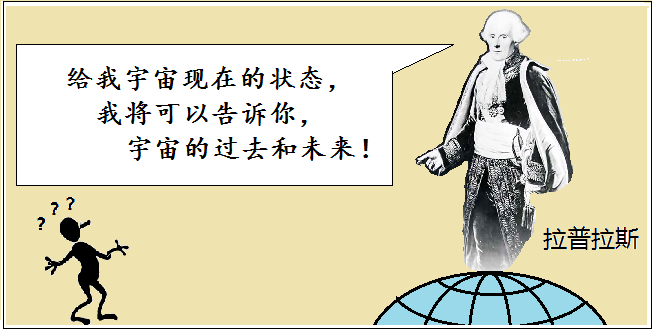

虽然拉普拉斯妖，后来被证明是不可能的。但它确实反映了解决通用问题的一种做法。

### 弱智能之麦克斯韦妖

另一个物理学的思想实验，来自麦克斯韦。这个思想实验的目的，是为了挑战热力学第二定律。该定律指出，封闭系统最终会达到热平衡。

于是，麦克斯韦假设存在一种智能体：麦克斯韦妖，看守暗门，观察分子运动速度。使较快的向某侧流动，较慢向另一侧流动。经过充分长的时间，两侧温差会越来越大 。温度高低是分子运动剧烈程度的宏观表现，通过分隔不同运动速率的分子，就让系统的两个部分的分子有了不同的剧烈程度。

## 什么是机器学习?

机器学习，是英文 Machine Learning 的直译。它是实现人工智能的其中一种方式。前面说过的拉普拉斯妖就是不是机器学习的方式。

人类的学习，可以归纳为这种现象：随着经验的增加，解决问题的能力得到提升。

对机器而言，经验其实就是数据。机器学习就是：用数据训练程序以优化其表现的算法。

机器学习是一个相对宽泛的概念，只要满足它的定义，就属于机器学习。并不是一定要 GPU/TPU 训练，一定要多少行代码，一定要解决多宏大的难题，才叫机器学习。用数据训练一个模型，拟合一个点，也是机器学习的体现。

## 机器学习的分类?

机器学习有两种分类：监督学习和非监督学习。

区分这两种学习方式的依据很简单，就是训练数据是否包含了答案。包含答案，就是监督学习；不包含答案，就是非监督学习。当然，这里也存在中间状态，包含一个渐进式答案，或者其它形式的间接答案等，就叫半监督学习。

## 什么是深度学习?

深度学习，是英文 Deep Learning 的直译。它是实现机器学习的其中一种方式。机器学习还包含其它实现方案。

深度学习里，用到了人工神经网络，这是一个用计算机模拟大脑神经元运作模式的算法。同时，这个人工神经网络的隐藏层数量还必须足够多，才能构成深度神经网络。然后喂之以大量的训练数据，就是深度学习了。

换一个角度，如果隐藏层数量不多，而是每个隐藏层里包含的神经元数量很多，在形态上，它就是一个往宽度发展的神经网络结构。这时，可能就叫广度学习了。

目前，深度学习还是主流，它的训练效率，优于广度学习。

## AI & ML & DL & GA 的关系

下图展示了人工智能，机器学习，人工神经网络，深度学习和遗传算法之间的关系。我们可以看到，除了遗传算法是交集关系意外，其余的是分离出一个个子集的关系。

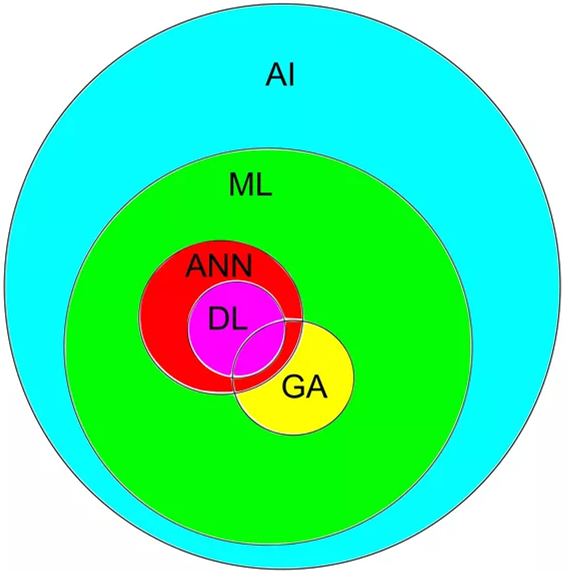

## 前端工程师与人工智能

前端工程师跟人工智能，有什么关系呢?

这个问题应该反过来问，首先，按照目前的发展，将来会跟所有人产生紧密关联。前端工程师也是人类，作为人类，应该在某种程度上了解人工智能，而后能更好地使用人工智能的产品。

其次，前端工程师，也是程序员。我们可以在程序员的层面，比普通人更好地理解人工智能背后的机制。

再次，我们才是前端工程师。在前端工程师的角度，去审视人工智能未来是否会取代我们的工作。它取代我们之后，会不会有新的工作岗位出来，比如 AI 前端工程师。这时，那些对人工智能更加了解的前端工程师，就更容易得到相关的岗位了。

更何况，了解人工智能，说不定有机会转型成 AI 程序员。

编程语言、开源社区、IDE 等持续发展，会不断降低人工智能的开发门槛。过去的经验告诉我们，可能五年前高级程序员才能做到的事情，现在一个的普通程序员也有望做到。

人工智能这个概念，是在上世纪 50~60 年代提出的。当时，关心人工智能的那帮人，都是计算机里的鼻祖人物和数学家们。但是现在，作为前端工程师的我，居然也能写上一些代码，在 web 页面上跑起机器学习的 DEMO，这不正反映了门槛的降低趋势。

## UI 开发的三种模式

- 手写标签和样式代码，生成页面
- 可视化拖拽 UI 组建，生成页面
- [直接输入设计稿，输出可用页面](https://github.com/tonybeltramelli/pix2code)

要想在前端自动化上做到极致，也无法跳开人工智能环节。pix2code 这个项目就是一个案例。虽然现在它的能力还很弱，使用场景很有限。但我们不要忘记，人工智能的发展速度，可能是指数级的。谷歌的阿尔法狗，一开始只是打败了人类业余围棋玩家，后面战胜了人类顶尖玩家李世石，再后面击败了当时的世界第一柯洁。然后，再无对手，又开始抛弃人类经验，通过自我对弈的方式，打败之前的版本。再到后面，竟已不局限于围棋，拓展到了国际象棋，日本将棋等其它棋类游戏里。这里的发展速度，是非常快的。

所以，不能因为 pix2code 目前的能力，盲目乐观。

## 数学知识回顾：什么是导数？

霍金在写《时间简史》时说过，书里没出现一个公式，书的销量就减半。这反映了公式在科普和推广阶段的负面作用。

但是，不用公式和代码，又要讲明白机器学习，几乎是不可能的。听着玩儿的话，我们提供的 DEMO 和前面的概念介绍，也足够满足要求了。

接下来，是直面公式和代码的时刻，不能逃避，在真正理解后，你会发觉，原来公式才是最简单、最容易理解的那个。那些比喻、类比和段子，最后都不会在头脑里保留多久，只是在短时间内，营造了学到东西的虚假感受。

###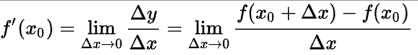
###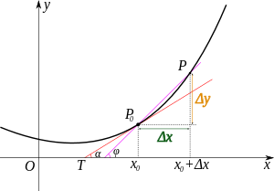

上面是导数的代数形式，下面是导数的几何形式。我们可以看到，导数，其实是围绕一个点来谈论的。当我们说一条线的导数是多少多少时，只是一个特例，恰好那条线上的每个点的导数都是同一个值。

当我们选取了一个点 x0 之后，在 X 轴上追加一个无穷小的增量，然后用 X 加上无穷小增量得到 x1，求得 x1 对应的 Y 轴的值 y1 之后，通过 x1 - x0 和 y1 - y0，我们得到了一个小三角形。这个小三角形的 y 轴长度，除以 x 轴长度，就时这个点 x0 的导数值。

关键点有两个。一个是找到小三角形，它是直角三角形。第二个除法，是用两个直角边相除，就得到了导数。导数反映了这个点跟下一个点的变化幅度和趋势。

## 数学知识回顾：什么是复合函数？

### 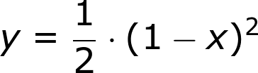
### 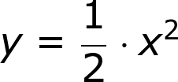
### 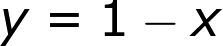

不是所有函数都那么简单，很多函数很复杂，甚至不能写在一条公式内，甚至不能用公式表达出来。

不过，我们还是可以从函数组合的角度，对许多复杂函数进行解构。

比如上面的第一条函数，虽然它本身已经够简单了。但其实还可以拆分成两个子函数的组合。

先计算第三条公式的结果 Y，在把 Y 作为 X 值，带入第二条公式内，求得另一个 Y 值。这个过程就相当于对第一条公式进行 Y 值计算。

## 数学知识回顾：什么是链式法则？

简单函数，有一些导数计算公式可以套用。那复杂函数里，又应该如何求导呢？

前面我们了解了复合函数的概念，它可以拆分成简单函数之间的组合关系。通过这个组合关系，我们可以用简单函数的导数，计算出复杂函数的导数。

### 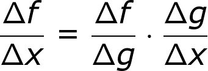
### 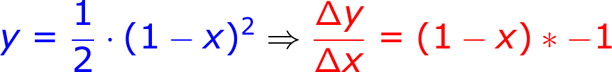

在介绍导数时，我们特别强调了“除法”，链式法则就是利用，除法和函数组合时产生的分子和分母的颠倒关系，不断地链式相乘，消掉中间变量，最后得到我们想要的目标导数值。

## 数学知识回顾：什么是梯度下降？

前面的数学知识部分，已经是本次分享里最难的环节了。后面是相对轻松的部分。

梯度下降，是机器学习里的重要概念。不管你去看谁的书或者视频，都绕不开这个概念。可能其中有些老师会打个比方说：假设你在一座山的山顶或者山腰上，你周围弥漫着浑厚的迷雾，无法看清下山的路，这是你要下山，要用什么方式？就是用脚探索更低点，然后逐步走下来。这就是梯度下降。

听了这个比喻，你理解了梯度下降吗?

反正我没有，下山我会，梯度下降嘛，还是不懂。

我们可以看到，比喻终究是间接的，含混的。还是要直面更直接和纯净的知识。

### 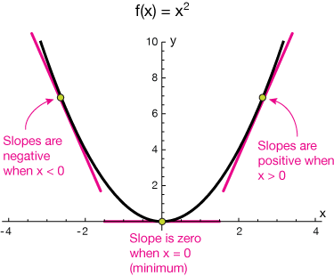

梯度下降，缘于这么个观测事实：

1）当我的导数是一个正数时，更低点在 -X 轴的方向；
2）当我的导数是一个负数时，更低点在 +X 轴的方向；
3）那么，不管我的导数是正数还是负数，它的反方向，就是更低点的方向。
4）沿着导数的反方向走，必将走到一个相对最低点。

这就是梯度下降。如果你理解了它，那你可以很容易地理解，什么是梯度上升。就是更高点，在沿着导数的方向嘛。

上图是一个 U 形图，只有一个最低点。如果是一个波浪图，那就有很多个局部最低点，如何找到全局最低点，目前也没有完美解决方案，还是一个难题。

## 数学知识回顾：什么是学习率？

梯度下降，只是为我们指明了更低点的方向，但却没有告诉我们距离。所以我们必须选择一个步伐大小，这个步伐大小，被称之为学习率。

### 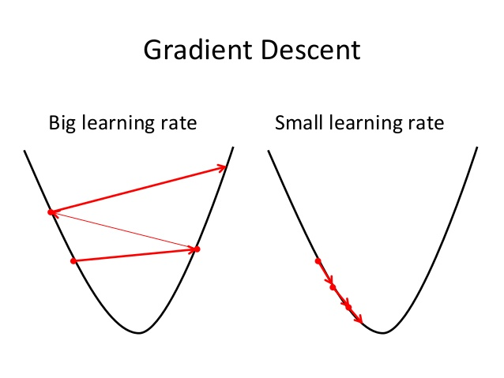

如果设置的学习率过大，步伐太大，一下子跨到对面去了，下次又走导数的反方向跨回来。就这样来来回回地振荡，没有走到一个令人满意的低点。

如果设置的学习率过小，走了很久，也仿佛在原地踏步。这也不行。

所以，选择一个合适的学习率，很重要。如何自动选择最优学习率，目前也是一个难题。

## 前端人工智障之拟合线段中心点

[在线 DEMO](https://lucifier129.github.io/simple-machine-learning-demo/01/index.html) 和 [源代码](https://github.com/Lucifier129/simple-machine-learning-demo/blob/master/01/index.js)

### 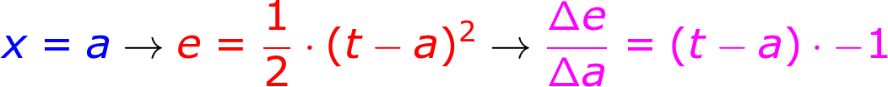
### 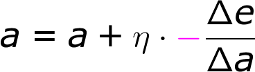

要拟合一个点，先要设置一个预测模型，在这里用 x = a 就可以了。最初 a 的值是随机的，或者设置为 0，也可以，权当瞎猜。

然后我们用生成的训练数据来喂给学习算法。数据里都包含了答案，我们就可以得到一个上图误差公式。它叫均方误差。用正确答案减去瞎猜的答案，得到一个值，再对其求平方，保证是正数。

有了均方误差公式，我们就可以用之前学到链式法则求导技巧，把 Y 轴设置成误差值 e，把 X 轴设置成参数 a，然后用梯度下降寻找误差最小的点，下一个 a 参数就是： a + 学习率 * -1 * 导数值。其中，（学习率 * -1 * 导数值）得到的就是往导数反方向走的那一小步的步长。

当误差最小点为 y = 0 点时，可以说，我们找到了理想的参数 a，它完美的，零误差地拟合了目标点。

值得一提的是，你可以看到误差 e 对模型输出的 y 的导数，由链式法则计算出来，恰好包含了一个 -1，而找最低点，是用导数的反方向，也包含一个 -1，这相乘就是负负得正，可以消掉。在有些机器学习的介绍公式和代码实现里，它们就省略这两个语义不同的 -1。这对于初学者来说，是非常要不得的。梯度下降的形式，看起来像梯度上升，容易混淆概念，徒增学习难度。

## 前端人工智障之拟合矩形中心点

矩形中心点，无非就是上面的 X 轴坐标点的基础上，增加一个 Y 轴的维度嘛。

[在线 DEMO](https://lucifier129.github.io/simple-machine-learning-demo/02/index.html) 和 [源代码](https://github.com/Lucifier129/simple-machine-learning-demo/blob/master/02/index.js)

### 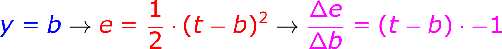
### 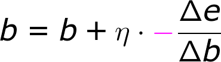

每个训练数据，都包含了 (x, y) 两个数据，我们增加一个对 y 轴的参数 y = b。然后用相同的套路，分别同步训练即可。

a = a + learningRate * - gradientA
b = b + learningRate * - gradientB

## 前端人工智障之线性回归
[在线 DEMO](https://lucifier129.github.io/simple-machine-learning-demo/03/index.html) 和 [源代码](https://github.com/Lucifier129/simple-machine-learning-demo/blob/master/03/index.js)
### 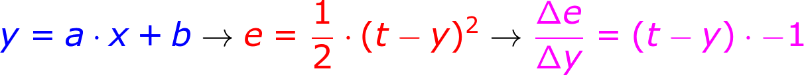
### 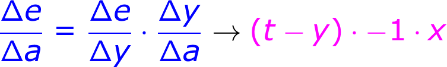
### 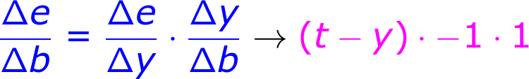

线性回归也是，除了预测模型的公式变成了 y = a * x + b，其它套路都一样。

在预测时，a 是常量系数，x 是自变量，y 是因变量。当调整参数 a 时，预测时输入的 x 成了 a 的常量系数了。所以对 y 求导 a，得到的值是 x 。

这里存在一个正向计算预测结果，反向修复参数误差的过程。

## 什么是感知机(Perceptrons)？
[在线 DEMO](https://lucifier129.github.io/simple-machine-learning-demo/04/index.html) 和 [源代码](https://github.com/Lucifier129/simple-machine-learning-demo/blob/master/04/index.js)
### 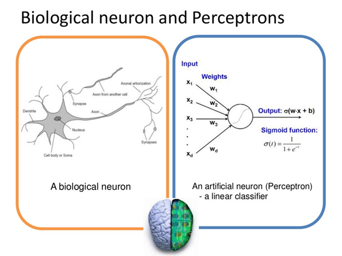

线性回归的公式是 y = a * x + b，从数学角度，很明显可以推广一下，成为 y = w1 * x1 + w2 * x2 + w3 * x3 + ... + wn * wn + b 的多因素形式。

在上面的基础上，再增加一个激活函数，就构造了一个被称之为感知机的模式。它最初是模拟大脑神经元在接受到刺激之后，根据是否达到阈值，来决定是否放电，刺激其它神经元。

感知机可以对多因素的事物，进行线性分类。比如对肿瘤进行良性肿瘤和恶性肿瘤的分类，对邮件进行垃圾邮件和非垃圾邮件的分类。不过，感知机的分类实现线性的，如果一个分类无法用线性分割出来，感知机就无法解决它。著名的与或问题，就曾经打击到了人工神经网络的研究热度。

## 什么是人工神经网络(ANN)？
### 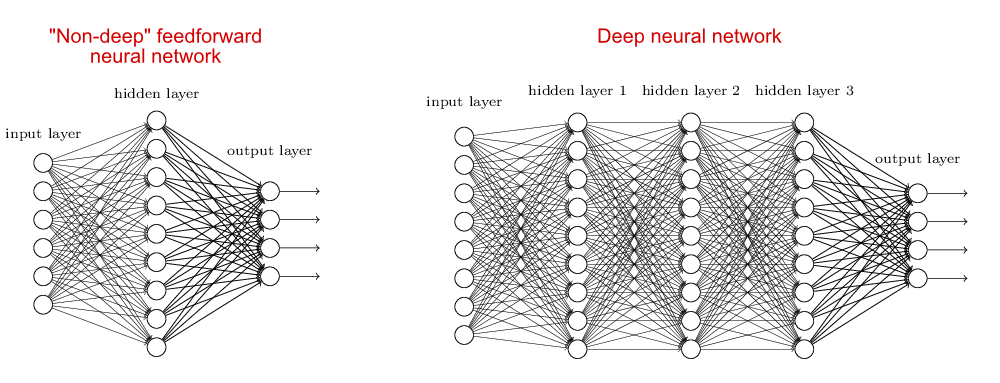

感知机是线性回归里的公式推广后的形态，而人工神经网络，则可以看成是感知机的推广形态。不只是一个人工神经元，而是多个神经元以某种网路结构链接在一起，配合非线性的激活函数，它可以实现更强大的分类和拟合能力。

反向传播算法，就是一种对多层人工神经网络进行调参的算法。它的原理，正如我们前面介绍的求导、链式法则和梯度下降。感兴趣的同学，可以尝试自行推导和实现一下反向传播算法。

## 什么是遗传算法(GA)？
### 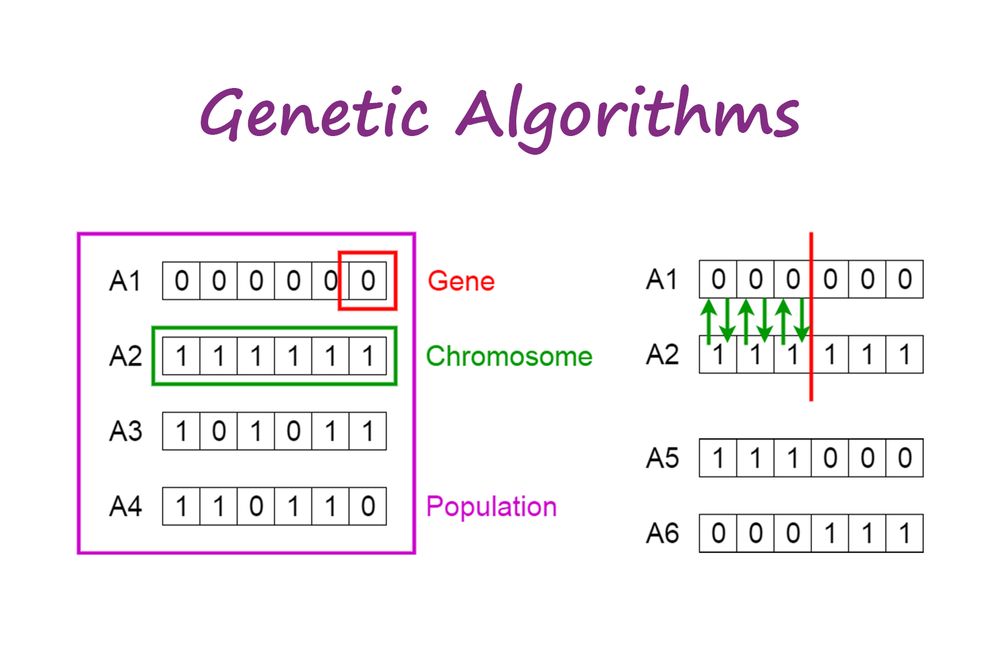

遗传算法是一个伟大的算法。对人类而言，可能是最伟大的算法。

因为，广义上的算法，不局限于编程领域。任何确定性的、在有限步骤下完成的特定步骤序列，都可以称之为算法。它可以是代码形式的，也可以是物理形式的。

人类本身，就可以看成遗传算法跑在大自然这个生态系统平台上的产物。

现在我们人类，又把遗传算法应用到了计算机平台上。所有能编码到一个序列的问题，都可以用遗传算法解决。区别在于，遗传算法未必是最好最经济的解决方案罢了。

像太阳系，或者宇宙，拥有庞大的资源，可以花费数十亿年的时间，跑遗传算法（自然选择），最后演化出人类智能。我们人类的算力，却着实有限，所以我们通常需要更高性能的算法。

遗传算法模拟了自然选择里的几个概念，基因、染色体以及种群，通过让两个染色体按照某个突变率交换基因位的编码，来不断得到新的，可能更好的解决方案。

遗传算法和人工神经网络结合起来，产生了一个被成为神经进化的算法。后面我们可以看到这个算法应用在玩 Flappy-bird 游戏的效果。

## 前端人工智障 DEMO
- [神经网络 + 遗传算法，玩 Flappy-Bird](https://lucifier129.github.io/factor-network/examples/build/#Flappy-Bird-Of-Neuroevolution-Without-Labeled-Data)
- [神经网络 + 反向传播，玩 Flappy-Bird](https://lucifier129.github.io/factor-network/examples/build/#Flappy-Bird-Of-Back-Propagation)
- [神经网络 + 遗传算法 + 变种，玩 Flappy-Bird](https://lucifier129.github.io/factor-network/examples/build/#Flappy-Bird-Of-Back-Propagation)
- [十大高手，玩 Flappy-Bird](https://lucifier129.github.io/factor-network/examples/build/#Flappy-Bird-Of-Ten-Masters)
- [反向传播，识别手写数字](https://lucifier129.github.io/factor-network/examples/build/#MNIST-Handwritten-Digit-Of-Back-Propagation)

Flappy-bird 等游戏，在每一帧里，都没有包含明显的正确决策，所以监督学习在这里比较难以派上用场。我们要用非监督的方式来学习。

第一个 DEMO，遗传算法 + 神经网络，生成一批神经网络模型，指导每只小鸟是否 flap 飞起来的决策。当鸟儿碰壁死绝，用每只鸟儿得到的 score 分数进行排名，然后让排名靠前的神经网络，繁殖更多，而排名靠后的繁殖更少，或者淘汰。经过 N 代的演化，最后得到优秀的神经网络参数模型。

第二个 DEMO，用第一个 DEMO 训练出来的优秀模型，作为正确答案的生成器，我们就可以得到一个监督学习的用场了。把优秀 Bird 的决策当作正确答案，喂数据给反向传播算法，当两者的误差趋于一个很小的值时，另一个优秀的模型就训练出来了。

第三个 DEMO，还是遗传算法 + 神经网络，只是这次，不是用分数高低来进行排名。分数不是答案，所以是非监督学习。这次，我们用第一个 DEMO 训练出来的优秀模型，作为正确答案的生成器。然后计算每只演化中的 Bird 模型的误差，误差大，排名靠后，误差小，排名靠前。由于训练包含了正确答案，所以是监督学习。最后，我们演化出了一个误差跟第一个 DEMO 训练的优秀模型很小的新模型。

如此可见，遗传算法 + 神经网络拥有更强的解决问题的能力，既可以监督学习，也可以非监督学习。但反向传播算法，只需要调整一个神经网络参数模型，而遗传算法的版本，却动辄成百上千个模型，性能自然不那么好。

第四个 DEMO，是用训练的 10 只优秀 Bird 模型角逐。目前为止，跑到 1 亿分，我也没见它们任何一个倒下。

第五个 DEMO，是机器学习里经典的 MNIST 手写数字训练集，采用的是反向传播算法的监督学习。可以识别你写在画板上的数字。

## 结语

尽管前端并非机器学习的主场，但作为学习，它可能挺适用的。起码我们可以更容易地在网页上看到效果。

当然，如果想更深入理解机器学习，需要去看更专业的书籍或教程。本次分享，主要是作为一个引导，激发大家对机器学习的兴趣。

