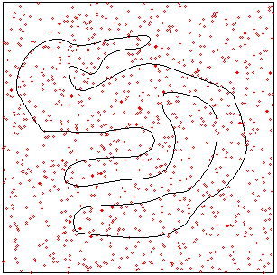
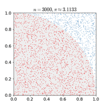
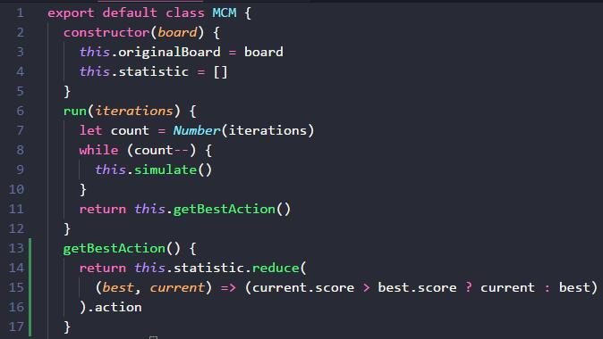
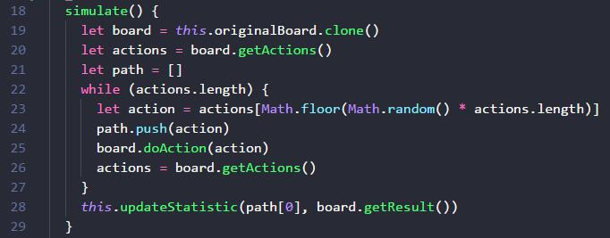
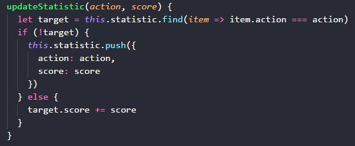
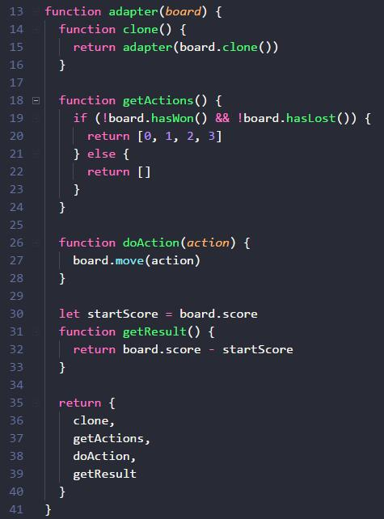
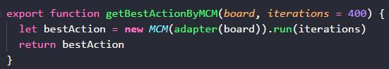
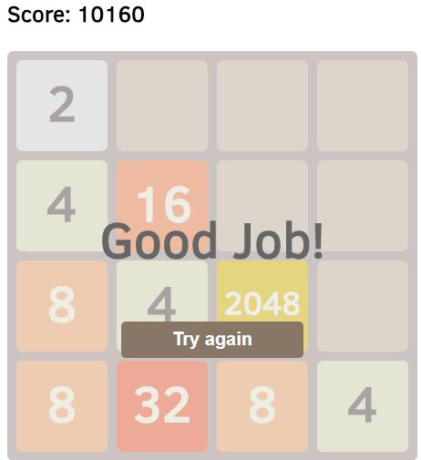

# 40+ 行 JS 代码打造你的 2048 游戏 AI

## 2048 游戏是什么？

2048 游戏如下图所示，它由一个 4*4 共 16 个方块组成。玩家可以通过「上下左右」四个方向操纵方块滑动，滑动时两个相邻且数值相同的方块会合并，新的方块，数值为两者之和。当游戏里任意方块的数值达到 2048，即为胜利。

我们将使用「蒙特卡洛方法」来打造 2048 AI。

## 蒙特卡洛方法是什么？

有很多问题，数学公式很复杂，甚至短时间内找不到数学公式。比如下面的不规则形状的面积。

我们可以通过一种「统计模拟」手段，在实践上得到上述不规则形状面积的近似值。做法就是：1）在正方形里生成许多位置随机的点；2）统计在不规则图形内的点的数量；3）计算步骤2得到的数量跟总数的比值；4）用正方形的面积乘以步骤三得到的比值，就是不规则形状面积的近似值。

上述做法，就是一个典型的蒙特卡洛方法。当我们生成的随机点数量足够大时，我们得到的近似值跟理论计算值就越发接近，误差越发小。如下图所示，求正方形里的扇形面积的蒙特卡洛方法的模拟过程：

上面两幅图，只是蒙特卡洛方法的两个应用而已。事实上，蒙特卡洛方法的适用范围很广，任何可模拟和统计的比例分布，都可以使用蒙特卡洛方法来模拟。比如检测硬币构造上是否足够均衡。

理论上，抛硬币的正反面概率是一样的，各50%。然而，实际工艺上，做不到绝对均匀，总有偏差。要想知道这个偏差，是偏向正面，还是偏向反面，可以使用蒙特卡洛方法。不断地抛硬币，然后统计正反面所占的比例，当抛硬币的次数是无限大时，这个比例就反映了硬币的均匀性。现实中，我们做不到无限次抛硬币，所以只能在某个误差范围内，得到硬币的均匀性评估。

总而言之，蒙特卡洛方法，在实践上给予我们这种便利：我们可以用模拟和统计，代替数学公式的运算过程，得到跟理论值相近的解。

## 蒙特卡洛方法和 2048 游戏

我们可以把蒙特卡洛方法，应用在 2048 游戏上。

对于 2048 游戏的任意状态，都有「上下左右」四个方向可以选择；虽然有时往某个方向走了以后，不会改变盘面的状态，但也是游戏支持的走法，并不会被判输，所以也是一个可选项。

这「上下左右」，哪个方向好，哪个方向坏，它们各自的胜率是多少？我们都不知道，但我们知道，客观上它们是有一种分布存在的。把它们四个的胜率加起来，必定等于 100%。

可以把这个「上下左右」想象成一个四面骰子，而且是不均匀的四面骰子；或者把它们想象成一个正方向被分成四块，而且是不均等的四块。我们有「2048 公式」可以套用吗？我们能直接计算出每一个方向的胜率面积占比吗？我不是数学家，我没有找到，但我知道蒙特卡洛方法，可以估测出近似解。所以来试试吧。

蒙特卡洛方法的极端情形，等价于暴力穷举，把四个方向，以及四个方向之后的四个方向，以及四个方向之后的四个方向的四个方向，每一个排列组合都走一遍，知道输或者赢；然后统计一下走「上下左右」时每个的胜利次数，跟总次数相除，就得到胜率了。

暴力穷举太粗暴？没关系。模拟 400 次，可能准确率就达到 90% 呢，剩下的无限次，或许只是把 90% 的准确率提到到 100% 罢了。

##  蒙特卡洛方法代码

按照蒙特卡洛方法的描述。

第一步，先写一个类，有 run 方法，run 方法接受一个参数 iterations，表示模拟多少次，simulate 方法就是模拟。

模拟完毕之后，getBestAction 获取分数最高的那个 action 动作。

simulate 方法怎么写呢？就是不断地随机选一个方向，走到死。board.getActions 方法要在胜利或者失败时，返回空数组，表示玩家在游戏里没有任何有效动作可以做了。这样 while 死循环就可以得到释放。

board.doAction 应该是让游戏进入下一个状态。如果游戏步骤是无限的，那么我们需要控制一下一次模拟的时间长短，或者 doAction 的次数，对于 2048 等非无限步骤游戏来说，这一步倒可以省略。

模拟时，需要 board.clone 复制一个，避免影响到当前游戏的状态。如果我们拿不到游戏模拟器，蒙特卡洛方法就没有那么方便地派上用场。

path 数组变量，记录了我们这次模拟的 action 序列。

当我们一次模拟走到死之后，就把当前第一个 action 和本次模拟的结果（胜负01或者得分 score），存到统计表里累计。为什么是第一个action？因为我们的目的就是找到当前游戏的下一步动作，所以模拟的第一步动作，对应的就是我们实际上要做的下一部动作。

最后一个方法 updateStatistic，就是我们更新统计表了。它的实现也很简单，就是判断一下这个动作是否已经存在，存在就累计，不存在就创建。

不知道你是否注意到，我们的代码里，并没有 2048 限定的内容，而是在操作一个 board，以及 clone, getActions, doAction, getResult 等高度抽象的方法？

没错，我们刚才实现的蒙特卡洛方法，不是为 2048 定制的，它可以使用在不同的棋盘游戏、视频游戏或者跟步骤序列相关的游戏里。只要写一个适配器，把游戏状态和动作导出到 clone, getActions, doAction, getResult 等接口即可。

## 2048 游戏适配蒙特卡洛方法

只需要很简短的几行代码，就可以提供让 2048 board 实例的方法，适配我们所实现的「蒙特卡洛方法类」。

在 getActions 里，判断 2048 board 当前是否胜利(hasWon)或者失败(hasLost)，如果是，就返回空数组，如果不是，就返回 [0, 1, 2, 3] 数组表示「上下左右」。

getResult 返回结果就是，先记录模拟前的分数 board.score 为 startScore，在模拟后，getResult 时，把当前的 board.score - startScore，就得到本次模拟的挣到的实际分数。

doAction 方法里简单地调用 board.move 移动方向。为什么要抽象成 doAction，而非 doMove 呢？因为有些游戏的动作，不局限于移动啊，所以 move 太具体了，action 更抽象，可以表示更多可能的动作。

写完适配器之后，就可以输出一个方法 getBestAction，只要把当前 2048 board 输入进来，就用蒙特卡洛方法模拟 400 次，然后返回统计上得分最高的那个 action，作为下一个 action。

每走一步都跑一下蒙特卡洛方法，虽然重复走了很多次，但没关系，只要性能跟得上，重复就重复吧，重复带来更多的模拟次数，也意味着更准确拟合了理论上的面积分布。

如果 400 次模拟，准确度不够，可以增加到 800 次， 2000 次，总有一个数量级，可以达到满意的结果。

## 胜利的结果

下图是在我机器上模拟后，成功抵达 2048 的截图。你也可以在自己机器上看一下这个过程。当然，最好你可以动手实现一下蒙特卡洛方法的算法，加固印象。

[点击这里，访问 DEMO](https://lucifier129.github.io/factor-network/examples/build/#Game-2048-Of-Monte-Carlo-Method)。[点击这里，访问源代码](https://github.com/Lucifier129/factor-network/blob/master/src/MCM.js)。

请关注我的微信公众号。有机会，我们再介绍基于蒙特卡洛方法的「蒙特卡洛树搜索（MCTS）」，它其实是蒙特卡洛方法在编程上的结构优化，本质还是蒙特卡洛方法。

